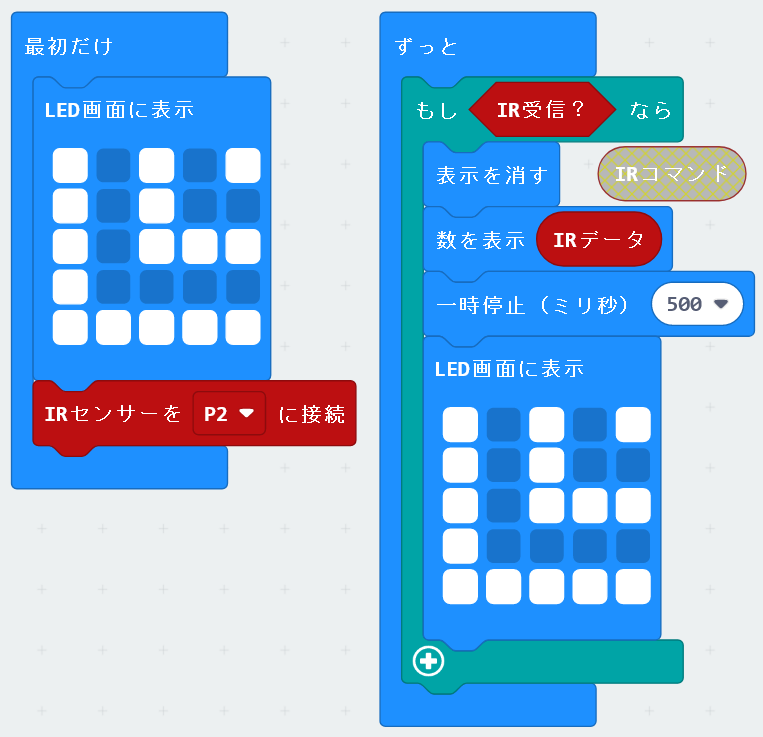

## リモコン受信

 **拡張機能** としてリモコン受信を追加できます。

* [https://makecode.microbit.org/](https://makecode.microbit.org/) を開く
* **新しいプロジェクト** をクリックしてください
* ギアボタンメニューの中にある **拡張機能** をクリックしてください
* **https://github.com/kukirobotclub/pxt_ir_rcv** を検索してインポートします。

## 追加されるブロック

### １．まず手持ちのリモコンで、使いたいボタンの番号を調べる
以下のコードで最大３桁の番号を記録する

* 手元のリモコンの使いたいボタンを押すと、LED画面に最大３つの番号が出るので、記録しておく
* ボタンを押す間隔は長めにする
* 使う可能性のあるボタンは全部記録しておくと良い

### １.５．使いたいボタンの番号を調べる（別方法）
特定のリモコンで、どのボタンでも同じ番号になる。
番号が最大５桁になる。

#### ２．リモコンで指示をするプログラムを作成する
調べた番号を使って、押したボタンによって動くプログラムを作る
以下の例は、↑＝244、↓＝245 とわかったので、そのボタンで矢印を表示するもの

------
●動作確認済み
NECリモコン
PanasonicのDVDレコーダーリモコン
SONYのTVリモコン
