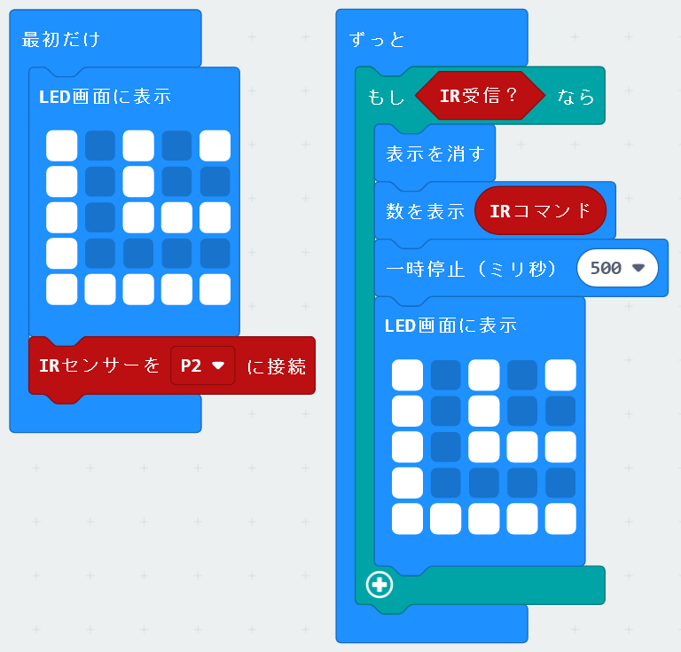

## リモコン受信

 **拡張機能** としてリモコン受信を追加できる。

* [https://makecode.microbit.org/](https://makecode.microbit.org/) を開く
* **新しいプロジェクト** をクリック
* メニューの中にある **拡張機能** をクリック
* **https://github.com/kukirobotclub/pxt_ir_rcv** を検索してKRC_IR_RECIVERを追加。

## 追加されるブロック

### １．まず手持ちのリモコンで、使いたいボタンの番号を調べる
以下のコードで最大３桁の番号を記録する。

* 手元のリモコンの使いたいボタンを押すと、LED画面に最大３つの番号が出るので、記録しておく
* ボタンを押す間隔は長めにする（ボタンを長く押すと、表示のあとにゴミ表示が出る）
* 使う可能性のあるボタンは全部記録しておくと良い

### １.５．使いたいボタンの番号を調べる（別方法）
特定のリモコンで、どのボタンでも同じ番号になることがあるのでこの方法。
番号が最大５桁になる。（最初からこちらでもいいが覚える数字が多いため）

#### ２．リモコンで指示をするプログラムを作成する
調べた番号を使って、押したボタンによって動くプログラムを作る。
以下の例は、↑＝244、↓＝245 とわかったので、そのボタンで矢印を表示するもの。

------
#### ３．プログラムの注意

------
●動作確認済み　

NECリモコン　
PanasonicのDVDレコーダーリモコン　
SONYのTVリモコン　

------

センサー接続方法

------

Copyright 2022 KRC / Bitcom

Out workshop https://kuki-robot-club.localinfo.jp/
