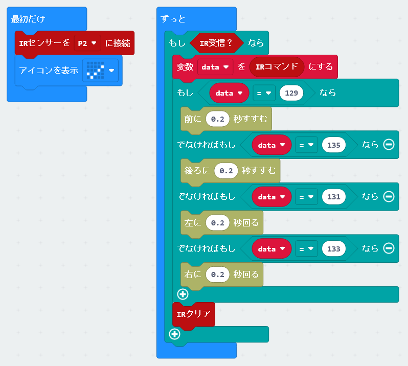

# KRC赤外線リモコンロボット

## URL

**https://github.com/kukirobotclub/pxt_ir_rcv** 
**https://github.com/kukirobotclub/pxt-krc-motor-easy** 
上記のアドレスを拡張機能から張り付けて、２つの拡張ブロックを導入する

## プログラム

・すすむ時間は短いほうが反応がいい 
・最後の「IRクリア」がないと、モーターが動いている間に次のボタンを読むので長く押したようになってしまう 

## ライセンス

GNU 

Bitcom 

Copyright 2022 KRC / Bitcom
